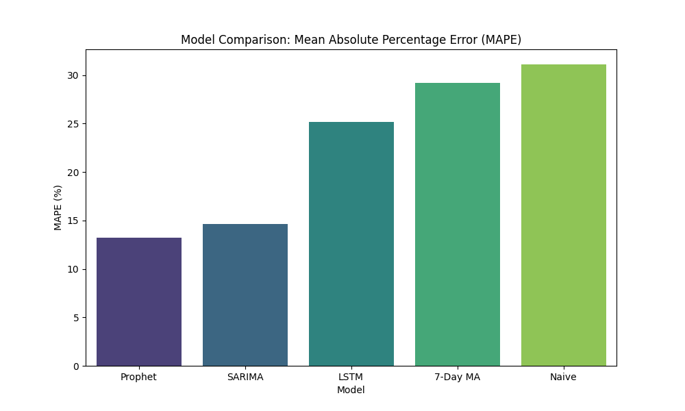

# Demand Forecasting Report

## 1. Exploratory Data Analysis (EDA) Findings
- **Store Selection**: Store 85 was selected due to having no missing sales data and being open consistently (100% open ratio over 942 days).
- **Trend & Seasonality**: The seasonal decomposition revealed a clear weekly seasonality pattern in the sales data.
- **Stationarity**: The ADF test indicated that the sales series is stationary (p-value < 0.05).
- **Exogenous Effects**: Promotions significantly increase average sales, while State Holidays drastically reduce sales (often to zero, as the store is closed).

## 2. Model Comparison

### Metric Explanations
- **MAE (Mean Absolute Error)**: The average absolute difference between the predicted sales and the actual sales (how many units we are off by on average).
- **RMSE (Root Mean Squared Error)**: Similar to MAE but heavily penalizes large errors, meaning a high RMSE indicates the model makes occasional massive mistakes.
- **MAPE (Mean Absolute Percentage Error)**: The average error represented as a percentage of actual sales, making it the easiest metric to interpret across different sales volumes.

| Model | MAE | RMSE | MAPE |
|---|---|---|---|
| Prophet | 953.26 | 1269.95 | 13.19% |
| SARIMA | 1038.70 | 1373.73 | 14.64% |
| LSTM | 1840.37 | 2300.15 | 25.16% |
| 7-Day MA | 2067.67 | 2479.21 | 29.21% |
| Naive | 2242.68 | 2858.83 | 31.11% |

## 3. Conclusion
The Prophet model is the clear winner, achieving the lowest error across all metrics with a MAPE of 13.19%. While SARIMA also performed exceptionally well (14.64% MAPE), Prophet's ability to seamlessly integrate the highly impactful `Promo` regressor gave it the winning edge. The LSTM model outperformed the simple baselines but fell significantly short of the classical statistical approaches; this is expected, as deep learning models generally require massive datasets (e.g., modeling all stores simultaneously) rather than a single univariate time-series to truly shine. Because Prophet significantly beat the 7-Day MA floor (29.21%) and handled exogenous effects perfectly, it is the best choice for our production deployment.
